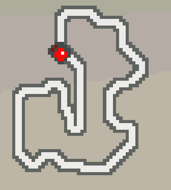
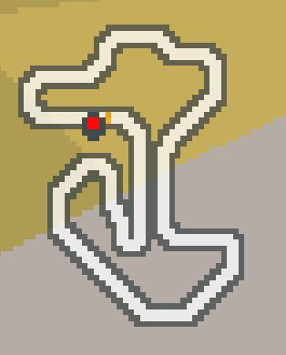

# Hot Wheels Gymnasium Environment
By: Zack Beucler
<p align="left">
  </img>
</p>

**HotWheelsGym** is a [gymnasium](https://github.com/Farama-Foundation/Gymnasium) enviroment for the 2005 GBA game [Hot Wheels Stunt Track Challenge.](https://tcrf.net/Hot_Wheels:_Stunt_Track_Challenge_(Game_Boy_Advance))

# Notable features

- **Multiple Tracks:** _TRex Valley_ and _Dinosaur Boneyard_. More to come.
- **Two game modes:** _single_  where you race alone and _multi_ where you race 3 NPCs.

# Installation

```bash
git clone https://github.com/zbeucler2018/HotWheelsGym.git
cd HotWheelsGym
pip install -e . # [train,dev]
```

# Basic usage

```python
import HotWheelsGym
from HotWheelsGym import HotWheelsEnv, Tracks, RaceModes

# only need to import the ROM once
HotWheelsGym.import_rom("path/to/rom.gba")

env = HotWheelsEnv(
  track=Tracks.Dino_Boneyard,
  mode=RaceModes.MULTI,
  laps=3
)

# OR

env = HotWheelsGym.make("HWSTC-dino_boneyard-multi-3")
```

# Enviroment

Use the template
```
HWSTC-<track>-<mode>-<laps>
```
where:

- `<track>` is the name of the track
- `<mode>` is the game mode {`single`, `multi`}
- `<laps>` is the total amount of laps {`1`, `2`, `3`}

## Track Varients

| Name | Map |
| ---- | ----- |
| `trex_valley` |  |
| `dino_boneyard` |  |

## Game Mode Varients

| Mode | Desc. |
| ------ | ---- |
| `single` | Single player. Race by yourself. |
| `multi`  | Multi player. Race against 3 NPCs. |
