# Hot Wheels Gymnasium Environment

By: Zack Beucler

<p align="left">
  </img>
</p>

**HotWheelsGym** is a [gymnasium](https://github.com/Farama-Foundation/Gymnasium) environment for the 2005 GBA game [Hot Wheels Stunt Track Challenge.](https://tcrf.net/Hot_Wheels:_Stunt_Track_Challenge_(Game_Boy_Advance))

# Notable features

- **Multiple Tracks:** 10 tracks to race on.
- **Two game modes:** _single_  where you race alone and _multi_ where you race against 3 NPCs.

# Installation

```bash
git clone https://github.com/zbeucler2018/HotWheelsGym.git
cd HotWheelsGym
pip install -e . # [train,dev]
```

# Basic usage

```python
import HotWheelsGym
from HotWheelsGym import HotWheelsEnv, Tracks, RaceModes

# only need to import the ROM once
HotWheelsGym.import_rom("path/to/rom.gba")

env = HotWheelsEnv(
  track=Tracks.Dino_Boneyard,
  mode=RaceMode.MULTI,
  total_laps=3
)

# OR

env = HotWheelsGym.make("HWSTC-dino_boneyard-multi-3")
```

## Train native NPCs and race your models

The repository includes native opponent control. The RAM self-play path patches
the race manager to create four player-class racers, so model opponents receive
the same 43-float ego-centric observation and the same seven discrete GBA button
actions as Player 1. The game still owns physics, collisions, rendering, and
race management.

This requires a locally generated ROM patch and fresh private start-line state;
neither is committed. See [NPC_ENVIRONMENT.md](NPC_ENVIRONMENT.md) for the
low-level research interface and [RAM_PLAYER.md](RAM_PLAYER.md) for the proven
Player-1/self-play workflow.

For the faster self-play path, the repository also has a separate Player 1
RAM trainer. Its checkpoints can be placed into native-button opponent slots as frozen
opponents while a newer Player 1 model trains against them. See
[RAM_PLAYER.md](RAM_PLAYER.md). This code path does not import or modify the
pixel trainer.

# Environment

Use the template
```
HWSTC-<track>-<mode>-<laps>
```
where:

- `<track>` is the name of the track
- `<mode>` is the game mode {`single`, `multi`}
- `<laps>` is the total amount of laps {`1`, `2`, `3`}

## Track Varients

| Name | Map | 
| ---- | ----- |
| `trex_valley` | 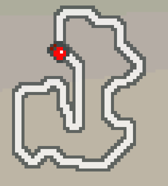 |
| `dino_boneyard` | 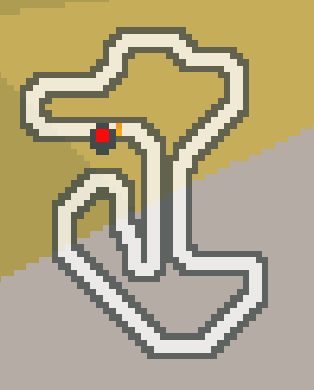 |
| `black_widows_nest` | 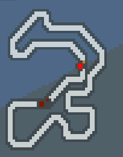 |
| `insect_hive` | 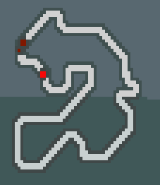 |
| `monsters_of_the_deep` | 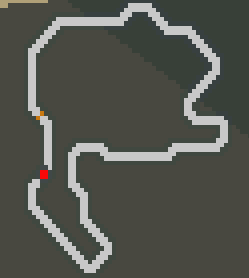 |
| `whiteskull_cliffs` | 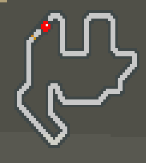 |
| `jungle_snakepit` | 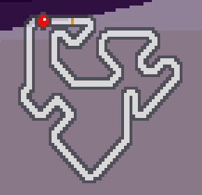 |
| `gator_forest` | 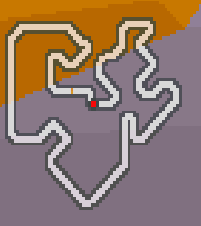 |
| `satellite_mission` | 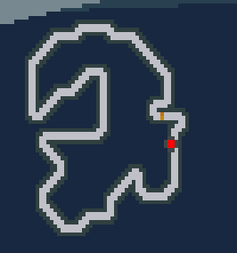 |
| `solar_strip` | 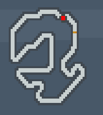 |
| `fire_mountain` | 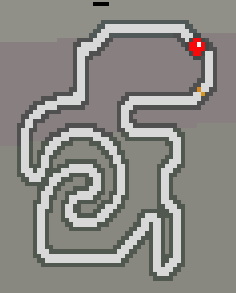 |
| `volcano_battle` | 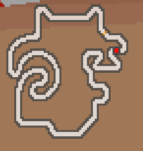 |


## Game Mode Varients

| Mode | Description |
| ------ | ---- |
| `single` | Single player. Race by yourself. |
| `multi`  | Multi player. Race against 3 NPCs. |

## Information returned from the environment

- The `info` dict returned by the `step` function contains the following keys:

| Key | Type | Description |
| --- | ---- | ----------- |
| `boost` | `int` | The current amount of boost the agent has. `980` is the max and will allow the agent to use the boost. |
| `hit_wall` | `bool` | `True` if the agent currently collided with a wall, `False` if not. |
| `lap` | `int` | The current lap the agent is on. |
| `checkpoint` | `int` | The checkpoint the agent is currently at on the track. |
| `rank` | `int` | The current rank of the agent in the race. `multi` mode only. |
| `score` | `int` | The current score of the agent. |
| `speed` | `int` | The agent's current (estimated) speed. |

### Checkpoints per lap

| Track | Checkpoints per lap |
| ----- | --- |
| `trex_valley` | 316 |
| `dino_boneyard` | 342 |
| `black_widows_nest` | 395 |
| `insect_hive` | 380 |
| `monsters_of_the_deep` | 342 |
| `whiteskull_cliffs` | 340 |
| `jungle_snakepit` | 465 |
| `gator_forest` | 512 |
| `satellite_mission` | 376 |
| `solar_strip` | 325 |
| `fire_mountain` | 465 |
| `volcano_battle` | 495 |
